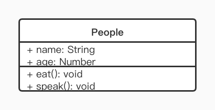
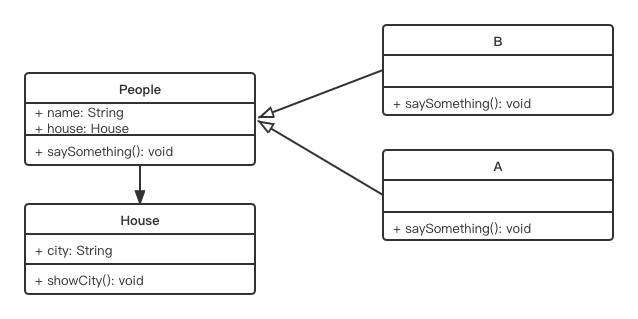

# 什么是面向对象

- 概念
- 三要素:继承, 多态, 封装
- JS 的应用举例
- 面向对象的意义


## 概念

```js
// 类, 即模板
class Person {
	constructor(name, age) {
		this.name = name
		this.age = age
	}

	eat() {
		alert(`${this.name} eat something`)
	}

	speak() {
		alert(`My name is ${this.name}, age ${this.age}`)
	}
}

// 创建实例
let zhang = new Person('zhang', 20)
zhang.eat()
zhang.speak()

// 创建实例
let wang = new Person('wang', 21)
wang.eat()
wang.speak()
```

## 三要素

- 继承, 子类继承父类
- 封装, 数据的权限和保密
- 多态, 同一接口不同实现

## 三要素-继承
```js
// 父类
class People {
	constructor(name, age) {
		this.name = name
		this.age = age
	}

	eat() {
		alert(`${this.name} eat something`)
	}

	speak() {
		alert(`My name is ${this.name}, age ${this.age}`)
	}
}

// 子类 继承父类
class Student extends People {
	constructor(name, age, number) {
		super(name, age)
		this.number = number
	}

	study() {
		alert(`${this.name} study`)
	}
}

// 实例
let xioaming = new Student('xiaoming', 10, 'A1')
xioaming.study()
alert(xioaming.number)
xioaming.eat()

// 实例
let xiaohong = new Student('xiaohong', 11, 'A2')
xiaohong.speak()
xiaohong.study()
```

- People是父类, 公共的, 不仅仅服务于 Student
- 继承可将公共方法抽离出来, 提高复用, 较少冗余

## 三要素-封装

- public 完全开发
- protected 对子类开放
- private 对自己开放

用于属性,方法的定义

通过 typescript 代码演示

```ts
// 父类
class People {
	name // 默认 public
	age
	protected weight  // 定义 protected 属性,只有自己或者子类可以访问
	constructor(name, age) {
		this.name = name
		this.age = age
		this.weight = 120
	}

	eat() {
		alert(`${this.name} eat something`)
	}
		
	speak() {
		alert(`My name is ${this.name}, age ${this.age}`)
	}
}

// 子类
class Student extends People {
	number
	private girlfriend

	constructor(name, age, number) {
		super(name, age)
		this.number = number
		this.girlfriend = 'xiaoli'
	}

	study() {
		alert(`${this.name} study`)
	}

	getWeight() {
		alert(`weight ${this.weight}`)
	}
}

let xiaoming = new Student('xiaoming', 10, 'A1')
xiaoming.getWeight()
// tsc 编译不通过
xiaoming.wieght 
alert(xiaoming.girlfriend)

// src/index1.ts:43:10 - error TS2339: Property 'wieght' does not exist on type 'Student'.

// 43 xiaoming.wieght
//             ~~~~~~

// src/index1.ts:44:16 - error TS2341: Property 'girlfriend' is private and only accessible within class 'Student'.

// 44 alert(xiaoming.girlfriend)
//                   ~~~~~~~~~~


// Found 2 errors.
```

- 减少耦合,不该外露的不外露
- 利于数据, 接口的权限管理
- ES6 目前不支持, 一般认为 _ 开头的属性是 pivate

## 三要素-多态

- 同一接口,不同表现
- JS 应用极少
- 需要结合 Java 等语言的接口, 重写, 重载等功能

```java
class People {
	constructor(name) {
		this.name = name
	}

	saySomthing() {}
}

class A extends People {
	constructor(name) {
		super(name)
	}

	saySomthing() {
		alert('I am A')
	}
}

class B extends People {
	constructor(name) {
		super(name)
	}

	saySomthing() {
		alert('I am B')
	}
}

let a = new A('A')
let b = new B('B')

a.saySomthing()
b.saySomthing()
```

- 保持子类的开放性和灵活性
- 面向接口编程
- JS 引用极少, 了解即可


## JS 应用举例
```js
class jQuery {
	constructor(selector) {
		let slice = Array.prototype.slice
		let dom = slice.call(document.querySelectorAll(selector))
		let len = dom ? dom.length : 0
		for(let i = 0; i < len; i++){
			this[i] = dom[i]
		} 
		this.length = len
		this.selector = selector || ''
	}

	append(node){
		// ...
	}

	addClass(name) {
		// ...
	}

	html(data) {
		// ....
	}

	// 此处略去 N 个 API
}

window.$ = function(selector) {
	// 工厂模式
	return new jQuery(selector)
}

let $p = $('p')
console.log($p);
console.log($p.addClass);
```

## 为何使用面向对象

程序执行: 顺序, 判断, 循环 --> 结构化

面向对象 --> 数据结构化

对于计算机, 结构化的才是最简单的

## UML 类图



### 关系

- 泛化, 表示继承
- 关联, 表示引用

```js
class People {
	constructor(name, house) {
		this.name = name
		this.house = house
	}

	saySomething() {}
}

class A extends People {
	constructor(name, house) {
		super(name, house)
	}

	saySomething() { alert('I am A') }
}

class B extends People {
	constructor(name, house) {
		super(name, house)
	}

	saySomething() { alert('I am B') }
}

class House {
	constructor(city) {
		this.city = city
	}

	showCity() {
		alert(`house in ${this.city}`)
	}
}

// 测试
let aHouse = new House('北京')
let a = new A('aaa', aHouse)
console.log(a) // a 套房子
let b = new A('bbb')
console.log(b) // b 无房子
```

