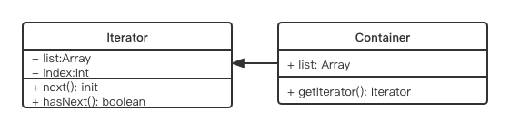

# 迭代器模式

## 介绍
- 顺序访问一个集合
- 使用者无需知道集合的颞部结构(封装)

```xml
<!DOCTYPE html>
<html lang="en">
<head>
	<meta charset="UTF-8">
	<meta http-equiv="X-UA-Compatible" content="IE=edge">
	<meta name="viewport" content="width=device-width, initial-scale=1.0">
	<title>Document</title>
</head>
<body>
	<div id="div1">
		<a href="#">a1</a>
		<a href="#">a2</a>
		<a href="#">a3</a>
		<a href="#">a4</a>
		<a href="#">a5</a>
	</div>
	<script src="https://cdn.bootcss.com/jquery/3.3.0/jquery.js"></script>
	<script>
		let arr = [1, 2, 3]
		let nodeList = document.getElementsByTagName('a')
		let $a = $('a')

		// 遍历数组
		arr.forEach(item => {
			console.log(item)
		})

		// 遍历 nodeList
		let i, length = nodeList.length
		for(i = 0; i < length; i++) {
			console.log(nodeList[i])
		}

		// 遍历$a
		$a.each((key, elem) => {
			console.log(key, elem)
		})

		function each(data) {
			let $data = $(data) // 生成迭代器
			$data.each((key, val) => {
				console.log(key, val)
			})
		}

		each(arr)
		each(nodeList)
		each($a)

	</script>
</body>
</html>
```

## UML 类图



## 代码演示

```js
class Iterator {
	constructor(container) {
		this.list = container.list
		this.index = 0
	}

	next() {
		if(this.hasNext()) {
			return this.list[this.index++]
		}
		return null
	}

	hasNext() {
		if(this.index >= this.list.length) {
			return false
		}
		return true
	}
}

class Container {
	constructor(list) {
		this.list = list
	}

	// 生成遍历器
	getIterator() {
		return new Iterator(this)
	}
}

let arr = [1, 2, 3, 4, 5. 6]
let containetr  = new Container(arr)
let iterator = container.getIterator()

while(iterator.hasNext()){
	console.log(iterator.next())
}
```

## 场景
- jQuery each
```js
function each(data) {
	let $data = $(data) // 生成迭代器
	$data.each((key, val) => {
		console.log(key, val)
	})
}

each(arr)
each(nodeList)
each($a)
```
- ES6 Iterator
  
	- ES6 Iterator 为何存在?
		- ES6 语法中, 有序数据集合的数据类型已经有很多
		- Array, Map, Set, String, TypedArray, arguments, NodeList
		- 需要有一个统一的遍历接口来遍历所有有序集合的数据类型
  - ES6 Iterator 是什么?
    - 以上数据类型, 都有 `[Symbol.iterator]` 属性
    - 属性值是函数, 执行函数会返回一个函数
    - 这个迭代器就有 next 方法可顺序迭代子元素
    - 可运行 Array.prototype[Symbol.iterator] 来测试

ES6 Iterator 实例
```js
function each(data) {
	let iterator = data[Symbol.iterator]()

	let item = { done: false }

	while(!item.done) {
		item = iterator.next()
		if(!item.done) {
			console.log(item.value)
		}
	}
}
```

`Symbol[iterator]` 并不是人人都知道, 也不是每个人都需要封装一个 each 方法

因此有了 `for...of...` 语法

```js
function each(data) {
	for(let item of data) {
		console.log(item)
	}
}

each(arr)
each(nodeList)
each(map) // 
```