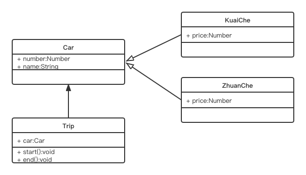
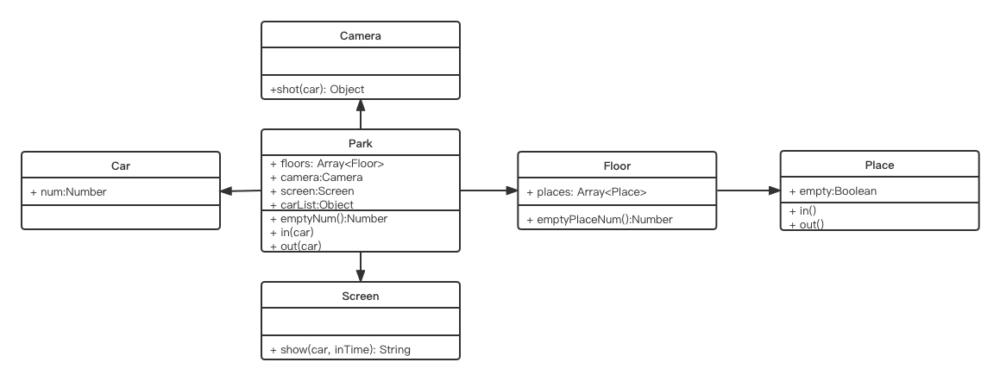

# 设计原则

- 何为设计

- 五大设计原则 SOLID

- 从设计到模式

- 23 种设计模式

## 何为设计

- 按照哪一种思路或者标准来实现功能
- 功能相同, 可以有不同设计方案来实现
- 伴随需求增加, 设计的作用才能体现出来

### UNIX/LINUX 设计哲学
- 准则 1: 小即是美
- 准则 2: 让每个程序只做好一件事
- 准则 3: 快速建立原型
- 准则 4: 舍弃高效率而取可移植性
- 准则 5: 采用纯文本存储数据
- 准则 6: 重复利用软件的杠杆效应()
- 准则 7: 使用 shell 脚本提高杠杆效应和可移植性
- 准则 8: 避免强制性的用户界面
- 准则 9: 让每个程序都称为过滤器

演示: 沉默是金 + 让每个程序成为过滤器

## S O L I D 五大设计原则
- S - 单一职责原则
- O - 开放封闭原则, 对扩展开放, 对修改封闭
- L - 李氏置换原则
- I - 接口独立原则
- D - 依赖导致原则

###  S - 单一职责原则
- 一个程序只做好一件事
- 如果功能过于复杂就拆分开,每个部分保持独立

### O - 开放封闭原则
- 对扩展开放,对修改封闭
- 增加需求时, 扩展新代码, 而非修改已有代码
- 软件设计的终极目标

### L - 李氏置换原则
- 子类能覆盖父类
- 父类能出现的地方子类就能出现
- JS 中使用较少(弱类型 & 继承使用较少)

### I - 接口独立原则
- 保持接口的单一独立, 避免出现 "胖接口"
- JS 中没有接口(ts 例外), 使用较少
- 类似于单一职责原则, 更关注接口

### D - 依赖倒置原则
- 面向接口编程, 依赖于抽象而不依赖具体
- 使用方只关注接口而不关注具体类的实现
- JS 中使用较少(没有接口 & 弱类型)

### promise演示 S.O.
```js

function loadImg(src) {
	let promise = new Promise(function(resolve, reject) { 
		let img = document.createElement('img')
		img.onload = function() {
			resolve(img)
		}

		img.onerror = function() {
			reject('图片加载失败')
		}

		img.src = src
	})
	return promise
}

let src = 'https://img3.sycdn.imooc.com/6113a49100015bed03700370-200-200.jpg'
let result = loadImg(src)

result
.then(function(img) {
	alert(`width: ${img.width}`)
	return img
})
.then(function(img) {
	alert(`height: ${img.height}`)
	return img
})
.catch(function(ex) {
	alert(ex)
})
```

## 23 种设计模式

- 创建型
  - 
  - 工厂模式(工厂方法模式, 工厂抽象模式, 创造者模式)
  - 单例模式
  - 原型模式
- 组合型
  - 
  - 适配器模式
  - 装饰器模式
  - 代理模式
  - 外观模式
  - 桥接模式
  - 组合模式
  - 享元模式
- 行为型
  - 
  - 策略模式
  - 模板方法模式
  - **`观察者模式`**
  - **`迭代器模式`**
  - 职责链模式
  - 命令模式
  - 备忘录模式
  - **`状态模式`**
  - 访问者模式
  - 中介者模式
  - 解释器模式

## 面试题示例

### 面试题 1

- 打车时, 可以打快车或者专车. 任何车都有车牌号和名称
- 不同车价格不同, 快车每1/公里,专车2元/公里
- 行程开始时, 显示车辆信息
- 行程结束时, 显示打车金额(假定行程就 5 公里)

要求:
- 画出 UML 类图



- 用 ES6 语法写出

```js
class Car {
	constructor(number, name) {
		this.name = name
		this.number = number
	}
}

class KuaiChe extends Car {
	constructor(number, name) {
		super(number, name)
		this.price = 1
	}
}

class ZhuanChe extends Car {
	constructor(number, name) {
		super(number, name)
		this.price = 2
	}
}

class Trip {
	constructor(car) {
		this.car = car
	}

	start() {
		console.log(`行程开始, 车名:${this.car.name}, 车牌号: ${this.car.number}`)
	}

	end() {
		console.log(`本行程共计: ${this.car.price * 5} 元`)
	}
}

let car = new KuaiChe(100, '桑塔纳')
let trip = new Trip(car)

trip.start()
trip.end()
```

### 面试题 2

- 某停车场, 分 3 层, 每层 100 车位
- 每个车位都能监控到车辆的驶入和离开
- 车辆进入前, 显示每层的空余车位数量
- 车辆驶入时, 摄像头可识别车牌号和时间
- 车辆出来时, 出口显示器显示车牌号和停车时长

要求
- 画出 UML 类图



- 写出 ES6 代码

```js
// 车辆
class Car {
	constructor(num) {
		this.num = num
	}
}

// 停车场
class Park {
	constructor(floors) {
		this.floors = floors || []
		this.camrea = new Camera()
		this.screen = new Screen()
		this.carList = {} // 存储摄像头拍摄返回的车辆信息
	}

	in(car) {
		// 通过摄像头获取信息
		const info = this.camera.shot(car)
		// 停到某个车位
		const i = parseInt(Math.random() * 100 % 100)
		const palce = this.floor[0].places[i]
		place.in()
		info.place = place
		this.carList[car.num] = info
	}

	out(car) {
		// 获取信息
		const info = this.carList[car.num]
		// 将停车位清空
		const place = info.place
		place.out()
		// 显示时间
		this.screen.show(car, this.inTime)
		delete this.carList[car.num]
	}

	emptyNum() {
		return this.floors.map(floor => {
			return `${floor.index} 层还有 ${floor.emptyPlaceNum()} 个空闲车位`
		}).join('\n')
	}
}

class Floor {
	constructor(index, places) {
		this.index = index
		this.places = places || []
	}

	emptyPlaceNum() {
		let num = 0
		this.places.forEach(p => {
			if(p.empty) {
				num += 1
			}
		})

		return num
	}
}

class Place {
	constructor() {
		this.empty = true
	}

	in() {
		this.empty = false
	}

	out() {
		this.empty = true
	}
}

class Camera {
	shot(car) {
		return {
			num: car.num,
			inTime: Date.now()
		}
	}
}

class Screen {
	show(car, inTime) {
		console.log('车牌号', car.num)
		console.log('停车时间', Date.now() - inTime)
	}
}
```