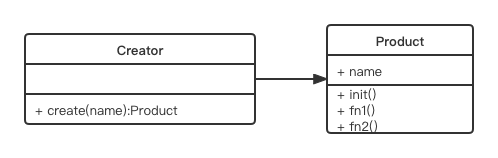

# 工厂模式

## 介绍

- 将 `new` 操作符单独封装
- `遇到 `*new*` 时, 就要考虑是否使用工厂模式`

## 示例
- 购买汉堡, 直接点餐, 取餐, 不会自己亲手做
- 商店要"封装"做汉堡的工作, 做好直接给买者

## UML 类图



代码演示

```js
class Product {
	constructor(name) {
		this.name = name
	}

	init() {
		alert('init')
	}

	fn1() {
		alert('fn1')
	}

	fn2() {
		alert('fn2')
	}
}

class Creator {
	create(name) {
		return new Product(name)
	}
}

// 测试
let creator = new Creator()
let p = creator.create('p1')

p.init()
p.fn1()
```

## 场景

- jQuery - $('div')
  - 
	- $('div') 和 new $('div')有何区别?
  	- 书写麻烦, jQuery 的链式操作将成为噩梦
  	- 一旦 jQuery 名字变化, 将是灾难性的
  	- 
- React.createElement
- vue 异步组件
