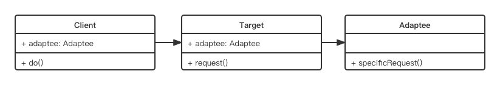

# 适配器模式

- 介绍
- 演示
- 场景

## 介绍

- 旧接口格式和使用者不兼容
- 中间加一个适配转换接口

(转换插头为例)

## UML 类图



`Client 没办法直接调用 Adapt 中的 specificRequest 方法`

## 代码演示

```js
class Adaptee {
	specificRequest() {
		return '德国标准插头'
	}
}

class Target {
	constructor() {
		this.adaptee = new Adaptee()
	}

	request() {
		let info = this.adaptee.specificRequest()
		return `${info} - 转换器 - 中国标准差头`
	}
}

// 测试
let target = new Target()
let res = target.request()
```

## 场景

- 封装旧接口

```js
// 自己封装的 ajax, 使用方式如下
ajax({
	url: '/getData',
	type: 'post',
	dataType: 'json',
	data: {
		id: '123'
	}
})
.done(function(){})

// 但因为历史原因, 代码中全是:
// $.ajax({...})

// 此时程序员没办法直接再通过 $.ajax 的方式使用, 所以做一层适配器
// 适配器
let $ = {
	ajax: function(options) {
		return ajax(options)
	}
}
```

- vue computed
```html
<div id="example">
	<p>original message: "{{ message }}"</p>
	<p>Computed reversed message: "{{ reversedMessage }}"</p>
</div>
```

```js
let vm = new Vue({
	el: '#example',
	data: {
		message: 'Hello'
	},
	computed: {
		// 计算属性的 getter
		reversedMessage: function() {
			// `this` 指向 vm 实例
			return this.messasge.split('').reverse().join('')
		}
	}
})
```