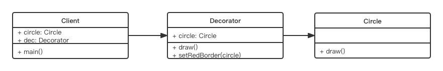

# 装饰器模式

## 介绍
- 为对象添加新功能
- 不改变其原有的结构和功能

## UML 类图




## 代码演示
```js
class Circle {
	draw() {
		console.log('画一个圆形')
	}
}

class Decorator {
	constructor(circle) {
		this.circle = circle
	}
	
	draw() {
		this.circle.draw()
		this.setRedBorder(this.circle)
	}

	setRedBorder(circle) {
		console.log('设置红色边框')
	}
}

// 测试代码
let circle = new Circle()
circle.draw()

console.log('---- 分割线 ----')

let dec = new Decorator(circle)
dec.draw()
```

## 场景

- ES7 装饰器
- core-decorators

### ES7 装饰器
安装 @babel/plugin-proposal-decorators 包
并在 .babelrc 文件中做如下配置
```json
{
	// ... 其余的配置
	"plugins": [
    ["@babel/plugin-proposal-decorators", { "legacy": true }]
	]
}
```

```js
// 一个简单的类
@testDec // 对 Demo 类做装饰
class Demo {
	// ...
}

// 装饰器
function testDec(target) { // target 就是一个 Demo
	target.isDec = true
}
alert(Demo.isDec) // true
```

**`装饰器原理`**

```js
@decorator
class A {}

// 等同于

class A {}
A = decorator(A)
```

**`装饰器就是一个函数`**, 把需要装饰的类传入函数中, 执行一遍

装饰器可添加参数

```js
function testDec(isDec) {
	// 装饰器要定义成一个函数
	return function(target) {
		target.isDec = isDec
	} 
}

@testDec(false)
class Demo {}

alert(Demo.isDec)
```

如果给装饰器传递参数, 则装饰器在定义的时候必须返回一个函数

### mixin 示例
```js
function mixins(...list) {
	return function(target) {
		Object.assign(target.prototype, ...list)
	}
}

const Foo = {
	foo() { alert('foo') }
}

@mixins(Foo)
class MyCalss {}

let obj = new MyClass()
obj.foo() // 'foo'
```

以上都是装饰类, 下面看下装饰方法

```js
// 例1
function readonlyl(target, name, descriptor) {
	// descriptor 属性描述对象, Object.defineProperty 中会用到, 默认的值如下
	//	{
	//		value: specifiedFunction,
	//		enumberable: false,
	//		configurable: true,
	//		writale: true 
	//	}
	descriptor.writable = false
	return descriptor
}

class Person {
	constructor() {
		this.first = 'A'
		this.last = 'B'
	}

	// 装饰方法
	@readonly
	name() {
		return `${this.first} ${this.last}`
	}
}

let p = new Person()
console.log(p.name())

// p.name = function() { ... } // 这里会报错, 因为 name 是只读的


// 例 2

function log(target, name, descriptor) {
	let oldValue = descriptor.value

	descriptor.value = function() {
		console.log(`Calling ${name} with`, arguments)
		return oldValue.apply(this, arguments)
	}

	return descriptor
}

class Math {
	// 装饰方法
	@log
	add(a, b) {
		return a + b
	}
}

const math = new Math()
const result = math.add(2, 4) // 执行 add 时, 会自动打印日志, 因为有 @log 装饰器
console.log('result', result)
```

### core-decorators

- 第三方开源的 lib
- 提供常用的装饰器, 如:readonly, log 装饰器

```js
// npm i core-decorators
import { readonly, deprecate } from 'core-decorator'

class Person {

	@readonly
	name() {
		return `${this.first} ${this.last}`
	}

	@deprecate // 废弃方法的装饰器
	facepalm() {}
}
```