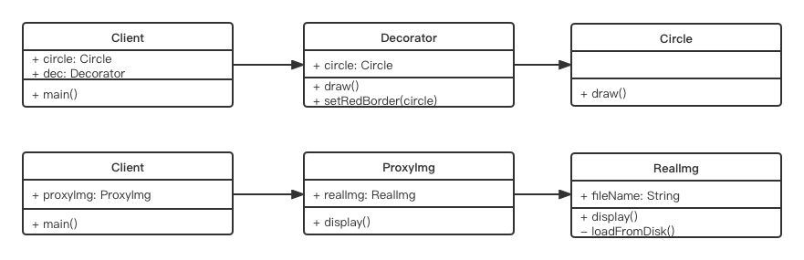

# 代理模式

## 介绍
- 使用者无权访问目标对象
- 中间加代理, 通过代理做授权和控制

## UML 类图


## 代码演示
```js
class RealImg {
	constructor(fileName) {
		this.fileName = fileName
		this.loadFromDisk() // 初始化即从硬盘中加载, 模拟
	}

	display() {
		console.log('display...' + this.fileName)
	}

	loadFromDisk() {
		console.log('loading...' + this.fileName)
	}
}

class ProxyImg {
	constructor(fileName) {
		this.realImg = new RealImg(fileName)
	}

	display() {
		this.realImg.display()
	}
}

// 测试
let proxyImg = new ProxyImg('1.png')
proxyImg.display()
```

## 场景
- 网页事件代理
- jQuery $.proxy
- ES6 Proxy

1. 网页事件代理

```xml
<!DOCTYPE html>
<html lang="en">
<head>
	<meta charset="UTF-8">
	<meta http-equiv="X-UA-Compatible" content="IE=edge">
	<meta name="viewport" content="width=device-width, initial-scale=1.0">
	<title>Document</title>
</head>
<body>
	<div id="div1">
		<a href="#">a1</a>
		<a href="#">a2</a>
		<a href="#">a3</a>
		<a href="#">a4</a>
		<a href="#">a5</a>
	</div>
	<script src="https://cdn.bootcss.com/jquery/3.3.0/jquery.js"></script>
	<script>
		let div1 = document.getElementById('div1')

		div1.addEventListener('click', e => {
			let target = e.target
			if(target.nodeName === 'A') {
				alert(target.innerHTML)
			}
		})
	</script>
</body>
</html>
```

2. $.proxy

```xml
<!DOCTYPE html>
<html lang="en">
<head>
	<meta charset="UTF-8">
	<meta http-equiv="X-UA-Compatible" content="IE=edge">
	<meta name="viewport" content="width=device-width, initial-scale=1.0">
	<title>Document</title>
</head>
<body>
	<div id="div1">
		<a href="#">a1</a>
		<a href="#">a2</a>
		<a href="#">a3</a>
		<a href="#">a4</a>
		<a href="#">a5</a>
	</div>
	<script src="https://cdn.bootcss.com/jquery/3.3.0/jquery.js"></script>
	<script type="javascript/text">
		// let div1 = document.getElementById('div1')

		// div1.addEventListener('click', e => {
		// 	let target = e.target
		// 	if(target.nodeName === 'A') {
		// 		alert(target.innerHTML)
		// 	}
		// })

		$('#div1').click(function() {
			// this 符合期望
			$(this).addClass('red')
		})
		$('#div1').click(function() {
			setTimeout(function() {
				// this 不符合期望
				$(this).addClass('red')
			}, 1000)
		});

		// 可以用如下方式解决
		$('#div1').click(function() {
			let _this = this
			setTimeout(function() {
				// this 符合期望
				$(_this).addClass('red')
			}, 1000)
		});

		// 推荐使用 $.proxy 解决, 可以少一个变量
		$('#div1').click(function() {
			setTimeout($.proxy(function() {
				// this 符合期望
				$(this).addClass('red')
			}, this), 1000)
		});
	</script>
</body>
</html>
```

3. ES6 Proxy

```js
// 明星
let star = {
	name: '张 xx',
	age: 25,
	phone: 'star: 13900001111'
}

// 经纪人
let agent = new Proxy(star, {
	get(target, key) {
		if(key === 'phone') {
			// 返回经纪人自己的电话
			return 'agent: 16899997777'
		}

		// 明星不报价, 经纪人报价
		if(key === 'price') {
			return 120000
		}

		return target[key]
	},
	set(target, key, val) {
		if(key === 'cusromPrice') {
			if( val < 10000) {
				// 最低 10w
				throw new Error('价格太低')
			} else {
				target[key] = val
				return true
			}
		}
	}
})

console.log(agent.name)
console.log(agent.age)
console.log(agent.phone)
console.log(agent.price)
```

## 代理模式 vs 适配器模式
- 适配器模式: 提供一个不同的接口(如不同版本的插头);`可以使用目标类, 但是没法用或者不好用`
- 代理模式: 提供一个一模一样的接口;`无权使用目标类, 但是想得到一模一样的效果`

## 代理模式 vs 装饰器模式
- 装饰器模式: 扩展功能, 原有功能不变且和直接使用
- 代理模式: 针对原有功能, 显示原有功能, 但是是经过限制或者阉割之后的