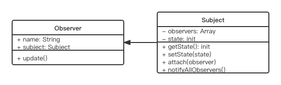

# 观察者模式

## UML 类图



## 代码演示

```js
// 主题,保存状态,状态变化之后触发所有观察者对象
class Subject {
	constructor() {
		this.state = 0
		this.observers = []
	}

	getState() {
		return this.state
	}

	setState(state) {
		this.state = state
		this.notifyAllObservers()
	}

	notifyAllObservers() {
		this.observers.forEach(observer => {
			observer.update()
		})
	}

	attach(observer) {
		this.observers.push(observer)
	}
}

// 观察者
class Observer {
	constructor(name, subject) {
		this.name = name
		this.subject = subject
		this.subject.attach(this)
	}

	update() {
		console.log(`${this.name} update, state: ${this.subject.state}`)
	}
}

// 测试
let s = new Subject()
let o1 = new Observer('o1', s)
let o2 = new Observer('o2', s)
let o3 = new Observer('o3', s)

s.setState(1)
s.setState(2)
s.setState(3)
```

## 场景

- 网页事件绑定
```js
<button id="btn1"></button>
<script type="javascript">
	$('#btn1').click( _ => {console.log(1)} )
	$('#btn1').click( _ => {console.log(2)} )
	$('#btn1').click( _ => {console.log(3)} )
</script>
```

- nodejs 自定义事件
```js
const { EventEmitter } = require('events')

const emitter1 = new EventEmitter()

emitter1.on('some', _ => {
	// 监听 some 事件
	console.log('some event is occured 1')
})

emitter1.on('some', _ => {
	// 监听 some 事件
	console.log('some event is occured 2')
})

// 触发 some 事件
emitter1.emit('some')
```

